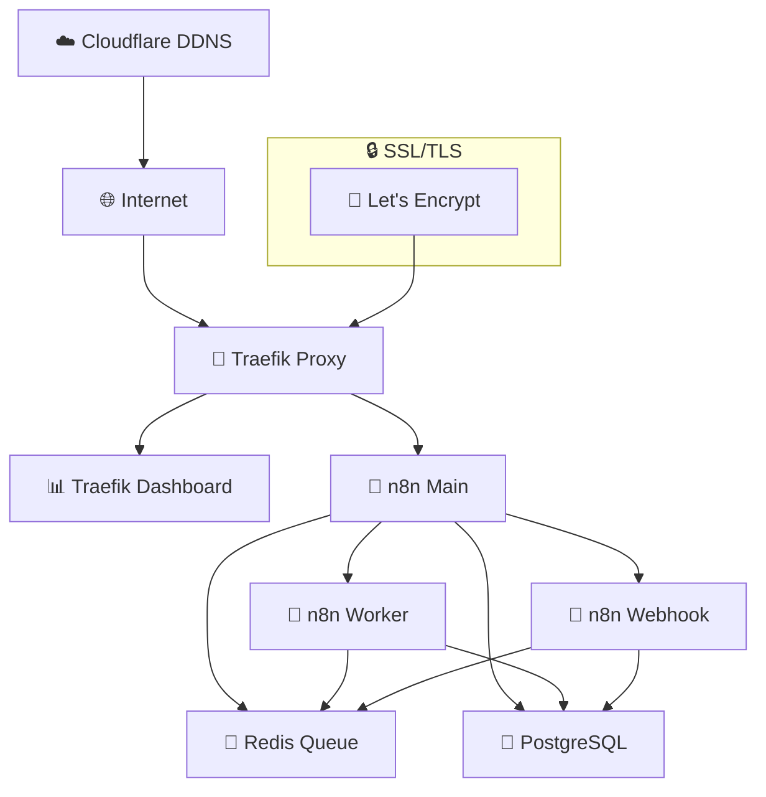

# 🚀 n8n Queue Mode com Traefik - Setup Completo

[](https://n8n.io/)
[](https://traefik.io/)
[](https://docker.com/)
[](https://postgresql.org/)
[](https://redis.io/)

> **Setup completo do n8n em modo fila (queue) com Traefik como reverse proxy, incluindo SSL automático e configuração para ambiente WSL/Windows.**

## 📋 Índice

- [📋 Índice](#-índice)
- [🎯 Sobre o Projeto](#-sobre-o-projeto)
- [✨ Características](#-características)
- [🏗️ Arquitetura](#️-arquitetura)
- [⚙️ Pré-requisitos](#️-pré-requisitos)
- [🚀 Instalação e Configuração](#-instalação-e-configuração)
  - [1. Preparação do Ambiente WSL](#1-preparação-do-ambiente-wsl)
  - [2. Clonagem e Configuração](#2-clonagem-e-configuração)
  - [3. Configuração de Variáveis de Ambiente](#3-configuração-de-variáveis-de-ambiente)
  - [4. Configuração DNS e Certificados](#4-configuração-dns-e-certificados)
  - [5. Configuração Específica WSL/Windows](#5-configuração-específica-wslwindows)
  - [6. Inicialização dos Serviços](#6-inicialização-dos-serviços)
- [🔧 Uso](#-uso)
- [🌐 URLs de Acesso](#-urls-de-acesso)
- [⚠️ Problemas Comuns e Soluções](#️-problemas-comuns-e-soluções)
- [🛠️ Manutenção](#️-manutenção)
- [📊 Monitoramento](#-monitoramento)
- [🔒 Segurança](#-segurança)
- [📚 Referências](#-referências)
- [🤝 Contribuição](#-contribuição)

## 🎯 Sobre o Projeto

Este projeto implementa uma instalação completa do **n8n** (plataforma de automação de fluxo de trabalho) executando em **modo fila** para alta escalabilidade, com **Traefik** como reverse proxy fornecendo terminação SSL automática e roteamento inteligente.

### 🎪 Cenário de Uso

- **Desenvolvimento local** em ambiente WSL/Windows
- **Produção** com domínios reais e certificados Let's Encrypt
- **Escalabilidade horizontal** com workers dedicados
- **Alta disponibilidade** com Redis como broker de mensagens

## ✨ Características

- ✅ **n8n em modo fila** - Escalabilidade horizontal com workers dedicados
- ✅ **Traefik Reverse Proxy** - Roteamento automático e terminação SSL
- ✅ **PostgreSQL** - Banco de dados robusto para persistência
- ✅ **Redis** - Message broker para comunicação entre workers
- ✅ **Certificados SSL automáticos** - Let's Encrypt integrado
- ✅ **Docker Compose** - Orquestração simplificada
- ✅ **Monitoramento integrado** - Dashboard do Traefik incluído
- ✅ **Cloudflare DDNS** - Atualização automática de DNS
- ✅ **Script de inicialização** - Setup automatizado com verificações
- ✅ **Compatibilidade WSL** - Configuração específica para Windows/WSL

## 🏗️ Arquitetura



### 📦 Componentes

| Componente | Função | Porta |
|------------|---------|-------|
| **Traefik** | Reverse Proxy + SSL | 80, 443, 8080 |
| **n8n-main** | Interface principal | 5678 (interno) |
| **n8n-worker** | Processamento de workflows | - |
| **n8n-webhook** | Webhooks dedicados | - |
| **PostgreSQL** | Banco de dados | 5432 (interno) |
| **Redis** | Message queue | 6379 (interno) |
| **Cloudflare DDNS** | Atualização DNS | - |

## ⚙️ Pré-requisitos

### 🖥️ Sistema Operacional
- **Windows 11/10** com WSL2 habilitado
- **Ubuntu 20.04+** no WSL ou instalação nativa Linux

### 🐳 Software Necessário
- **Docker Desktop** (Windows) ou **Docker CE** (Linux)
- **Docker Compose** v2.0+
- **Git**
- **Curl** e **OpenSSL**

### 🌐 Requisitos de Rede
- **Domínio próprio** com acesso ao DNS
- **Portas abertas** no roteador: 80, 443
- **IP público estático** ou serviço DDNS

### 📜 Certificados SSL
- Acesso a **Let's Encrypt** (certbot)
- **Cloudflare API Token** (opcional, para DDNS)

## 🚀 Instalação e Configuração

### 1. Preparação do Ambiente WSL

#### 🔧 Instalação do WSL2 (Windows)

```powershell
# Execute no PowerShell como Administrador
wsl --install -d Ubuntu
wsl --set-default-version 2
```

#### 🐳 Instalação do Docker no WSL

```bash
# Atualizar sistema
sudo apt update && sudo apt upgrade -y

# Instalar dependências
sudo apt install -y curl wget git openssl

# Instalar Docker
curl -fsSL https://get.docker.com -o get-docker.sh
sudo sh get-docker.sh

# Adicionar usuário ao grupo docker
sudo usermod -aG docker $USER

# Instalar Docker Compose
sudo curl -L "https://github.com/docker/docker-compose/releases/latest/download/docker-compose-$(uname -s)-$(uname -m)" -o /usr/local/bin/docker-compose
sudo chmod +x /usr/local/bin/docker-compose

# Reiniciar WSL
exit
# No PowerShell: wsl --shutdown
# Abrir WSL novamente
```

### 2. Clonagem e Configuração

```bash
# Clonar o projeto (ou baixar os arquivos)
git clone <seu-repositorio> n8n-queue-mode
cd n8n-queue-mode

# Verificar estrutura
ls -la
# Deve conter: docker-compose.yml, dynamic_conf.yml, start.sh, .env.example
```

### 3. Configuração de Variáveis de Ambiente

```bash
# Copiar arquivo de exemplo
cp .env.example .env

# Editar configurações
nano .env
```

#### 📝 Exemplo de .env

```bash
# === CONFIGURAÇÕES BÁSICAS ===
DOMAIN_NAME=meudominio.com
SUBDOMAIN=n8n

# === BANCO DE DADOS ===
POSTGRES_USER=n8n_user
POSTGRES_PASSWORD=senha_super_segura_123
POSTGRES_DB=n8n_db

# === N8N ===
N8N_ENCRYPTION_KEY=chave_criptografia_64_caracteres_muito_segura_mesmo_123456
EXECUTIONS_MODE=queue
GENERIC_TIMEZONE=America/Sao_Paulo

# === REDIS/QUEUE ===
QUEUE_BULL_REDIS_PASSWORD=redis_senha_123

# === TRAEFIK ===
TRAEFIK_AUTH_USERS=admin:$$2y$$10$$hash_bcrypt_da_senha

# === CLOUDFLARE (OPCIONAL) ===
CLOUDFLARE_API_TOKEN=seu_token_cloudflare
```

#### 🔐 Gerar Hash de Senha para Traefik

```bash
# Gerar hash bcrypt para senha "admin"
echo "admin" | openssl passwd -apr1 -stdin

# Ou usar htpasswd se disponível
htpasswd -nb admin sua_senha
```

### 4. Configuração DNS e Certificados

#### 🌐 Configuração DNS

No seu provedor de DNS, configure:

```
A    traefik.meudominio.com    → SEU_IP_PUBLICO
A    n8n.meudominio.com       → SEU_IP_PUBLICO
```

#### 📜 Geração de Certificados SSL

```bash
# Instalar certbot
sudo apt install -y certbot

# Parar serviços na porta 80/443 se houver
sudo systemctl stop apache2 nginx 2>/dev/null || true

# Gerar certificado para Traefik
sudo certbot certonly --standalone \
  --preferred-challenges http \
  -d traefik.meudominio.com

# Gerar certificado para n8n
sudo certbot certonly --standalone \
  --preferred-challenges http \
  -d n8n.meudominio.com

# Verificar certificados
sudo ls -la /etc/letsencrypt/live/
```

### 5. Configuração Específica WSL/Windows

> ⚠️ **ATENÇÃO**: Esta é a parte mais importante para evitar problemas!

#### 🖥️ Configuração do arquivo hosts do WSL

```bash
# Obter IP local do WSL
ip_wsl=$(hostname -I | awk '{print $1}')
echo "IP do WSL: $ip_wsl"

# Adicionar ao /etc/hosts do WSL
echo "$ip_wsl traefik.meudominio.com" | sudo tee -a /etc/hosts
echo "$ip_wsl n8n.meudominio.com" | sudo tee -a /etc/hosts
```

#### 🪟 Configuração do arquivo hosts do Windows

> **🔥 CRÍTICO**: O navegador Windows NÃO lê o `/etc/hosts` do WSL!

1. **Abrir Bloco de Notas como Administrador**
   ```
   Win + S → "Bloco de Notas" → Botão direito → "Executar como administrador"
   ```

2. **Abrir arquivo hosts do Windows**
   ```
   Arquivo → Abrir → C:\Windows\System32\drivers\etc\hosts
   Alterar filtro para "Todos os arquivos (*.*)"
   ```

3. **Adicionar entradas** (substitua `172.21.55.73` pelo seu IP WSL):
   ```
   # WSL n8n Project
   172.21.55.73 traefik.meudominio.com
   172.21.55.73 n8n.meudominio.com
   ```

4. **Salvar e limpar cache DNS**
   ```cmd
   # Abrir CMD como Administrador
   ipconfig /flushdns
   ```

### 6. Inicialização dos Serviços

```bash
# Tornar script executável
chmod +x start.sh

# Inicialização completa com verificações
./start.sh

# Ou inicialização com limpeza
./start.sh --clean

# Ou com monitoramento
./start.sh --monitor
```

## 🔧 Uso

### 🚀 Comandos Básicos

```bash
# Iniciar todos os serviços
./start.sh

# Parar todos os serviços
docker-compose down

# Reiniciar um serviço específico
docker-compose restart n8n-main

# Ver logs em tempo real
docker-compose logs -f n8n-main

# Ver status dos containers
docker-compose ps

# Executar comando no container
docker-compose exec n8n-main /bin/bash
```

### 📊 Verificação de Status

```bash
# Verificar se tudo está funcionando
curl -k https://traefik.meudominio.com/api/rawdata

# Testar n8n
curl -k https://n8n.meudominio.com/

# Ver routers do Traefik
curl http://localhost:8080/api/http/routers
```

## 🌐 URLs de Acesso

### 🖥️ Desenvolvimento (localhost)
- **Dashboard Traefik**: http://localhost:8080/dashboard/
- **API Traefik**: http://localhost:8080/api/rawdata

### 🌍 Produção (domínios)
- **Dashboard Traefik**: https://traefik.meudominio.com/dashboard/
  - 👤 Usuário: `admin` / Senha: `sua_senha`
- **n8n Interface**: https://n8n.meudominio.com/

## ⚠️ Problemas Comuns e Soluções

### 🔴 Erro: `ERR_CONNECTION_REFUSED` no navegador

**Problema**: Navegador Windows não consegue acessar domínios HTTPS.

**Causa**: Navegador resolve DNS público, mas não há port forwarding.

**Solução**:
1. ✅ Verificar se `/etc/hosts` do WSL está correto
2. ✅ **CRUCIAL**: Editar `/C:/Windows/System32/drivers/etc/hosts` do Windows
3. ✅ Executar `ipconfig /flushdns` como Administrador
4. ✅ Reiniciar navegador

### 🔴 n8n retorna 404

**Problema**: Traefik não roteia corretamente para n8n.

**Causa**: Configuração de service no docker-compose incorreta.

**Solução**:
```yaml
labels:
  - "traefik.http.routers.n8n.service=n8n"  # ← Linha obrigatória
```

### 🔴 Certificados SSL não funcionam

**Problema**: Erro de certificado SSL inválido.

**Causas e Soluções**:

1. **Certificados não gerados**:
   ```bash
   sudo certbot certonly --standalone -d seu.dominio.com
   ```

2. **Permissões incorretas**:
   ```bash
   sudo chown -R root:root /etc/letsencrypt/
   sudo chmod -R 755 /etc/letsencrypt/live/
   ```

3. **Configuração dynamic_conf.yml**:
   ```yaml
   tls:
     certificates:
       - certFile: /etc/letsencrypt/live/dominio/fullchain.pem
         keyFile: /etc/letsencrypt/live/dominio/privkey.pem
   ```

### 🔴 PostgreSQL não inicia

**Problema**: Container do PostgreSQL falha ao inicializar.

**Soluções**:
```bash
# Verificar logs
docker-compose logs postgres

# Limpar volumes
docker-compose down -v
docker volume prune -f

# Recriar
docker-compose up -d postgres
```

### 🔴 Redis Connection Failed

**Problema**: n8n não consegue conectar ao Redis.

**Verificação**:
```bash
# Testar conexão Redis
docker-compose exec redis redis-cli -a sua_senha_redis ping

# Verificar variável de ambiente
echo $QUEUE_BULL_REDIS_PASSWORD
```

### 🔴 IP do WSL mudou

**Problema**: Após reinicializar Windows, IP do WSL muda.

**Solução**:
```bash
# Script para atualizar hosts automaticamente
#!/bin/bash
NEW_IP=$(hostname -I | awk '{print $1}')
sudo sed -i '/traefik.meudominio.com/d' /etc/hosts
sudo sed -i '/n8n.meudominio.com/d' /etc/hosts
echo "$NEW_IP traefik.meudominio.com" | sudo tee -a /etc/hosts
echo "$NEW_IP n8n.meudominio.com" | sudo tee -a /etc/hosts
```

## 🛠️ Manutenção

### 🔄 Backup

```bash
# Backup do banco de dados
docker-compose exec postgres pg_dump -U n8n_user n8n_db > backup_$(date +%Y%m%d).sql

# Backup de volumes
docker run --rm -v queue-mode_n8n_data:/data -v $(pwd):/backup alpine tar czf /backup/n8n_backup_$(date +%Y%m%d).tar.gz /data
```

### 🔄 Restauração

```bash
# Restaurar banco de dados
cat backup_20250825.sql | docker-compose exec -T postgres psql -U n8n_user -d n8n_db

# Restaurar volumes
docker run --rm -v queue-mode_n8n_data:/data -v $(pwd):/backup alpine tar xzf /backup/n8n_backup_20250825.tar.gz -C /
```

### 🔄 Atualização

```bash
# Parar serviços
docker-compose down

# Atualizar imagens
docker-compose pull

# Iniciar com nova versão
./start.sh
```

### 🔄 Renovação de Certificados

```bash
# Renovar certificados (automático)
sudo certbot renew --quiet

# Verificar validade
sudo certbot certificates

# Reiniciar Traefik para carregar novos certificados
docker-compose restart traefik
```

## 📊 Monitoramento

### 📈 Logs

```bash
# Logs de todos os serviços
docker-compose logs -f

# Logs específicos
docker-compose logs -f n8n-main
docker-compose logs -f traefik

# Logs com timestamp
docker-compose logs -f --timestamps

# Últimas 100 linhas
docker-compose logs --tail=100 n8n-main
```

### 📈 Métricas

```bash
# Status dos containers
docker-compose ps

# Uso de recursos
docker stats

# Espaço em disco
docker system df

# Verificar health checks
docker-compose ps postgres  # deve mostrar "healthy"
```

### 📈 API do Traefik

- **Dashboard**: http://localhost:8080/dashboard/
- **API Raw**: http://localhost:8080/api/rawdata
- **Routers**: http://localhost:8080/api/http/routers
- **Services**: http://localhost:8080/api/http/services

## 🔒 Segurança

### 🔐 Recomendações de Produção

1. **Remover API insecure do Traefik**:
   ```yaml
   # Remover estas linhas do docker-compose.yml:
   - "--api.insecure=true"
   - "8080:8080"
   ```

2. **Senhas fortes**:
   ```bash
   # Gerar senhas seguras
   openssl rand -base64 32
   ```

3. **Firewall**:
   ```bash
   # Configurar UFW (Ubuntu)
   sudo ufw allow 80
   sudo ufw allow 443
   sudo ufw deny 8080  # Produção
   sudo ufw enable
   ```

4. **Backup seguro**:
   ```bash
   # Criptografar backups
   gpg --symmetric --cipher-algo AES256 backup.sql
   ```

### 🔐 Auditoria

```bash
# Verificar containers em execução
docker ps

# Verificar portas abertas
ss -tlnp

# Verificar logs de segurança
sudo tail -f /var/log/auth.log
```

## 📚 Referências

- 📖 [Documentação oficial n8n](https://docs.n8n.io/)
- 📖 [Documentação Traefik](https://doc.traefik.io/traefik/)
- 📖 [Docker Compose Reference](https://docs.docker.com/compose/)
- 📖 [Let's Encrypt Certbot](https://certbot.eff.org/)
- 📖 [WSL2 Documentation](https://docs.microsoft.com/en-us/windows/wsl/)

## 🤝 Contribuição

### 📋 Como Contribuir

1. Fork o projeto
2. Crie uma branch para sua feature (`git checkout -b feature/nova-feature`)
3. Commit suas mudanças (`git commit -am 'Adiciona nova feature'`)
4. Push para a branch (`git push origin feature/nova-feature`)
5. Abra um Pull Request

### 🐛 Reportar Problemas

Ao reportar problemas, inclua:

- ✅ Versão do sistema operacional
- ✅ Versão do Docker e Docker Compose
- ✅ Logs relevantes (`docker-compose logs`)
- ✅ Configuração (sem senhas!)
- ✅ Passos para reproduzir

### 📝 Arquivos de Diagnóstico

O projeto inclui arquivos de diagnóstico detalhados:

- **`diagnostics.md`** - Log completo de troubleshooting
- **`start.sh`** - Script de inicialização com verificações
- **Logs do Docker** - Para análise técnica

---

### 📞 Suporte

Para dúvidas e suporte:

- 🐛 **Issues**: Use as Issues do GitHub
- 📧 **Email**: Contato do mantenedor
- 💬 **Discord**: Link da comunidade (se houver)

---

**🎉 Parabéns! Seu ambiente n8n em modo queue com Traefik está pronto para uso!**

> 💡 **Dica**: Mantenha este README.md atualizado conforme evolui a configuração do projeto.
